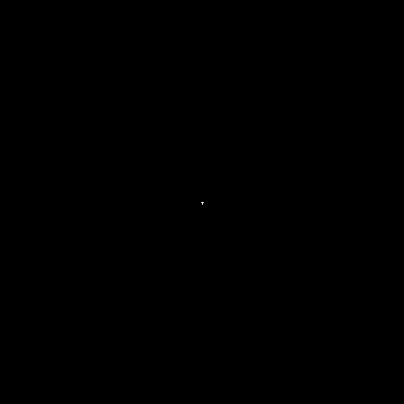

# Diffusion Limited Aggregation (DLA) Simulation and Fractal Dimension Estimation

This project consists of two Python scripts for simulating Diffusion Limited Aggregation (DLA) and estimating the fractal dimension of the resulting structures.

## Introduction

Diffusion Limited Aggregation (DLA) is a kinetic critical phenomenon observed in various physical systems, including the growth of aggregates in solutions, electrodeposition, and other processes. It is characterized by the aggregation of particles undergoing random motion and sticking to a growing cluster under specific conditions.

This project simulates the DLA process based on the model proposed in the published paper:

T.A. Witten, L.M. Sander, “Diffusion-Limited Aggregation, a Kinetic Critical Phenomenon”.

## Particle Aggregation Simulation (fractaFinal.py)

This script simulates particle aggregation within a grid and saves the final state as a GIF animation. The process involves:

- Initializing a grid with a central seed particle.
- Simulating particle aggregation through a random walk process.
- Saving the final grid state to a text file (`fractal_output.txt`).
- Saving the final state as a GIF animation (`fractal1.gif`).

  

## Fractal Dimension Estimation (fractalCalculations.py)

This script estimates the fractal dimension of the aggregated structures generated by `fractaFinal.py`. It performs the following steps:

- Loading the final grid state from `fractal_output.txt`.
- Calculating the fractal dimension using the box-counting method.
- Plotting the relationship between the logarithms of box size (L) and box count (M).
- Estimating the fractal dimension from the slope of the linear fit.

## Requirements

- Python 3.x
- NumPy
- Matplotlib
- PIL (Python Imaging Library)

## Usage

1. Run `fractaFinal.py` to generate the particle aggregation animation and final grid state.

    ```bash
    python fractaFinal.py
    ```

2. Run `fractal_dimension.py` to estimate the fractal dimension.

    ```bash
    python fractalCalculations.py
    ```

## License

This project is licensed under the [MIT License](LICENSE).
